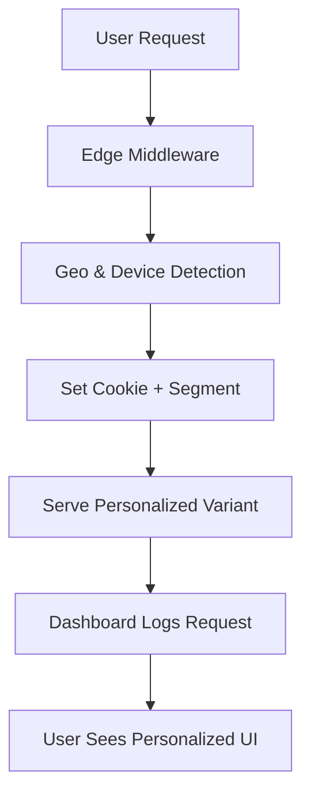

##  EdgeSync

A lightweight **Edge-powered personalization engine** that tailors website content to each user **instantly**, based on **location**, **device**, and **cookies**, all handled at the edge for **speed, scalability, and low latency**.

###  Overview

This MVP demonstrates how **personalized experiences** can be served right from the edge with no backend round trips or page reloads.
It intercepts requests using **Next.js Middleware**, detects user context, and renders personalized variants immediately.

Now with a **visual dashboard** that shows edge performance, live logs, and personalization analytics.

---

###  Key Features

*  **Edge Middleware Integration** — detects context at the edge before response.
*  **Location & Segment Awareness** — adapts UI content per user region.
*  **Interactive Dashboard** — visualize performance, user segments, and live logs.
*  **Persistent Context** — uses cookies to maintain personalized states.
*  **Zero Backend Load** — personalization handled completely at the edge.
*  **Configurable Rules** — easy to modify segments and variants.

---

###  Tech Stack

* **Framework:** Next.js  (App Router)
* **Language:** TypeScript
* **Runtime:** Vercel Edge Runtime
* **Logic:** Custom middleware + personalization engine
* **UI:** Tailwind CSS + React Hooks
* **Charts:** Recharts for performance visualization

---

###  Project Structure

```
edge-personalization/
├── middleware.ts                     # Edge logic entry point (detect location & segment)
│
├── app/
│   ├── page.tsx                       # Main landing page (PersonalizedHero)
│   ├── dashboard/
│   │   └── page.tsx                   # Dashboard main page entry
│   └── api/personalize/route.ts       # API route for testing personalization logic
│
├── lib/
│   ├── types.ts                       # Shared TypeScript interfaces
│   ├── utils/
│   │   ├── cookies.ts                 # Cookie management utilities
│   │   └── hash.ts                    # Hash function for anonymous tracking
│   └── personalization/
│       ├── engine.ts                  # Core personalization engine logic
│       ├── segments.ts                # Segment definition & rule mapping
│       └── variants.ts                # Variant content configuration
│
├── config/
│   └── personalization.ts             # Central configuration for rules and variants
│
├── components/
│   ├── dashboard/
│   │   ├── EdgeDashboard.tsx          # Main dashboard component
│   │   ├── StatsCard.tsx              # Reusable stat cards for quick metrics
│   │   ├── RegionList.tsx             # Panel showing active regions
│   │   ├── UserSegments.tsx           # Displays user segments with progress bars
│   │   ├── PerformanceChart.tsx       # Compares edge vs origin latency
│   │   ├── RequestsChart.tsx          # Requests per minute visualization
│   │   ├── LiveLogFeed.tsx            # Real-time log updates from edge requests
│   │   └── ComingSoon.tsx             # "Coming Soon" placeholder for future features
│   │
│   └── PersonalizedHero.tsx           # Front-facing component for users
│
└── hooks/
    └── usePersonalization.ts          # Hook to read and manage personalization state
```

---

###  How It Works

1. **Edge Middleware (`middleware.ts`):**
   Intercepts every request → detects user region (via headers) → sets cookie → routes request to the correct variant.

2. **Personalization Engine:**
   Uses `/lib/personalization/engine.ts` to interpret cookies and determine what variant should load (e.g., “US”, “Africa”, “Global”).

3. **Frontend Display:**

   * `/components/PersonalizedHero.tsx` uses `usePersonalization()` to show localized UI.
   * `/app/dashboard/page.tsx` + dashboard components visualize personalization metrics in real-time.

4. **Cookies & Persistence:**
   Cookies ensure returning visitors are shown the same personalized content instantly.

---

### 🧪 Dashboard Preview

| Component            | Purpose                                                            |
| -------------------- | ------------------------------------------------------------------ |
| **StatsCard**        | Shows quick stats like total requests, latency, and cache hit rate |
| **RegionList**       | Displays currently active regions served by the Edge               |
| **UserSegments**     | Visual representation of active segments and user distribution     |
| **PerformanceChart** | Compares edge performance vs origin requests                       |
| **RequestsChart**    | Requests per minute graph                                          |
| **LiveLogFeed**      | Streams recent personalization requests in real time               |
| **ComingSoon**       | Placeholder for upcoming dashboard modules                         |

---

### Example Edge Flow



---

###  Setup & Installation

```bash
# 1️⃣ Clone repository
git clone https://github.com/yourusername/edge-personalization.git
cd edge-personalization

# 2️⃣ Install dependencies
npm install

# 3️⃣ Run locally
npm run dev

# 4️⃣ Deploy to Vercel (Edge Runtime)
vercel deploy
```

---

### 📊 Future Roadmap

* [ ] Add analytics to track personalization performance
* [ ] Integrate user metrics and dashboard insights API
* [ ] Introduce time-based or behavior-based segments
* [ ] Add team view to monitor personalization efficiency

---
🔗 [LinkedIn](https://linkedin.com/in/fohalabi) 
