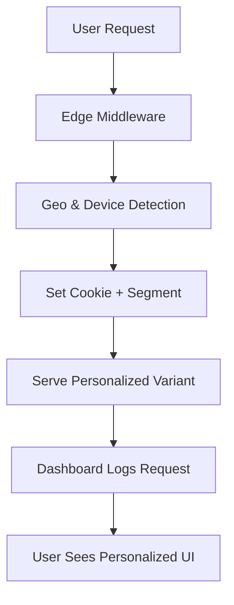

##  EdgeSync

A full-stack, context-aware personalization platform for designing rules, running controlled experiments, and measuring anonymous conversion performance from one Next.js application.

###  Overview

EdgeSync evaluates location, device, visitor, language, time, referrer, network, and pathname signals against explainable rules. Administrators can publish content, run deterministic weighted experiments, inspect live analytics, and review a durable activity trail.

---

###  Key Features

*  **Edge Middleware Integration** — detects context at the edge before response.
*  **Location & Segment Awareness** — adapts UI content per user region.
*  **Measured Analytics** — inspect impressions, conversions, latency, regions, segments, and recent decisions.
*  **Persistent Context** — uses cookies to maintain personalized states.
*  **Visual Rule Builder** — draft, preview, publish, duplicate, restore, and explain prioritized rules.
*  **Experiment Studio** — deterministic weighted assignment, audience targeting, uplift reporting, and winner promotion.
*  **Privacy Controls** — analytics are opt-in, visitor identifiers are hashed, and events have configurable retention.
*  **Administrator Audit Trail** — important rule and experiment changes are recorded for review.

---

###  Tech Stack

* **Framework:** Next.js  (App Router)
* **Language:** TypeScript
* **Runtime:** Vercel Edge Runtime
* **Logic:** Custom middleware + personalization engine
* **UI:** Tailwind CSS + React Hooks
* **Charts:** Recharts for performance visualization

---

###  Project Structure

```
edge-personalization/
├── middleware.ts                     # Edge logic entry point (detect location & segment)
│
├── app/
│   ├── page.tsx                       # Main landing page (PersonalizeHero)
│   ├── dashboard/
│   │   └── page.tsx                   # Dashboard main page entry
│   └── api/personalise/route.ts       # API route for personalization logic
│
├── lib/
│   ├── types.ts                       # Shared TypeScript interfaces
│   ├── utils/
│   │   ├── cookies.ts                 # Cookie management utilities
│   │   └── hash.ts                    # Hash function for anonymous tracking
│   └── personalization/
│       ├── engine.ts                  # Core personalization engine logic
│       ├── segments.ts                # Segment definition & rule mapping
│       └── variants.ts                # Variant content configuration
│
├── config/
│   └── personalization.ts             # Central configuration for rules and variants
│
├── components/
│   ├── dashboard/
│   │   ├── EdgeDashboard.tsx          # Main dashboard component
│   │   ├── StatsCard.tsx              # Reusable stat cards for quick metrics
│   │   ├── RegionList.tsx             # Panel showing active regions
│   │   ├── UserSegments.tsx           # Displays user segments with progress bars
│   │   ├── PerformanceChart.tsx       # Compares edge vs origin latency
│   │   ├── RequestsChart.tsx          # Requests per minute visualization
│   │   ├── LiveLogFeed.tsx            # Real-time log updates from edge requests
│   │   └── ComingSoon.tsx             # "Coming Soon" placeholder for future features
│   │
│   └── PersonalizeHero.tsx            # Front-facing component for users
│
└── hooks/
    └── usePersonalization.ts          # Hook to read and manage personalization state
```

---

###  How It Works

1. **Edge Middleware (`middleware.ts`):**
   Intercepts every request → detects user region (via headers) → sets cookie → routes request to the correct variant.

2. **Personalization Engine:**
   Uses `/lib/personalization/engine.ts` to interpret cookies and determine what variant should load (e.g., “US”, “Africa”, “Global”).

3. **Frontend Display:**

   * `/app/components/PersonalizeHero.tsx` uses `usePersonalization()` to show localized UI.
   * `/app/dashboard/page.tsx` + dashboard components visualize personalization metrics in real-time.

4. **Cookies & Persistence:**
   Cookies ensure returning visitors are shown the same personalized content instantly.

---

### 🧪 Dashboard Preview

| Component            | Purpose                                                            |
| -------------------- | ------------------------------------------------------------------ |
| **StatsCard**        | Shows quick stats like total requests, latency, and cache hit rate |
| **RegionList**       | Displays currently active regions served by the Edge               |
| **UserSegments**     | Visual representation of active segments and user distribution     |
| **PerformanceChart** | Compares edge performance vs origin requests                       |
| **RequestsChart**    | Requests per minute graph                                          |
| **LiveLogFeed**      | Streams recent personalization requests in real time               |
| **ComingSoon**       | Placeholder for upcoming dashboard modules                         |

---

### Example Edge Flow


```mermaid
graph TD;
A[User Request] --> B[Edge Middleware]
B --> C[Geo & Device Detection]
C --> D[Set Cookie + Segment]
D --> E[Serve Personalized Variant]
E --> F[Dashboard Logs Request]
F --> G[User Sees Personalized UI]
```

---

### Setup & installation

```bash
# 1. Clone and install
git clone https://github.com/fohalabi/edgesync.git
cd edgesync
npm install

# 2. Configure the environment
copy .env.example .env.local

# 3. Prepare PostgreSQL and seed the administrator
npm run db:migrate
npm run db:seed

# 4. Run locally
npm run dev
```

### Local authentication setup

Authentication uses a PostgreSQL-backed administrator and a signed HTTP-only session. Copy `.env.example` to `.env.local` (or update the scripts if you intentionally use another env filename), then set `DATABASE_URL`, `SESSION_SECRET`, `ADMIN_EMAIL`, `ADMIN_PASSWORD`, and `ADMIN_NAME`.

```bash
npm run db:migrate
npm run db:seed
```

`ADMIN_PASSWORD` must contain at least 12 characters. The seed command stores only its bcrypt hash and safely updates the same administrator when run again.

Analytics events use a 30-day reporting window. Set `ANALYTICS_RETENTION_DAYS` in `.env.local` and periodically run `npm run analytics:prune` to remove older events.

### Quality and deployment checks

```bash
npm test
npm run lint
npm run build
```

Before deploying, use a managed PostgreSQL database, generate a unique 32+ character `SESSION_SECRET`, use a strong administrator password, apply migrations, and schedule `npm run analytics:prune`. The application sends baseline browser hardening headers and never records analytics before visitor consent.

---

### 📊 Project Phases

* [x] **Phase 1 — Foundation:** working middleware, stable identity, content experiments, honest demo-data labelling, refreshed UI, and core tests.
* [x] **Phase 2 — Authentication:** email/password login, a seeded administrator, signed sessions, logout, throttling, and protected dashboard routes.
* [x] **Phase 3 — Context simulator:** shareable context overrides, presets, responsive previews, and reload-free evaluation.
* [x] **Phase 4 — Explainable engine:** serializable AND/OR rules, priorities, fallbacks, conflict detection, and condition-level decision traces.
* [x] **Phase 5 — Rule builder:** persistent drafts and published rules, visual conditions, live preview, duplication, JSON tools, and version history.
* [x] **Phase 6 — Analytics:** privacy-preserving impressions and conversions, latency percentiles, regional and segment reporting, live activity, and retention pruning.
* [x] **Phase 7 — Experiment studio:** weighted deterministic assignment, audience targeting, lifecycle controls, conversion results, and winner promotion.
* [x] **Phase 8 — Production polish:** consent-gated analytics, accessibility and responsive improvements, administrator audit history, safer destructive actions, security headers, documentation, and deployment hardening.

---
🔗 [LinkedIn](https://linkedin.com/in/fohalabi) 
